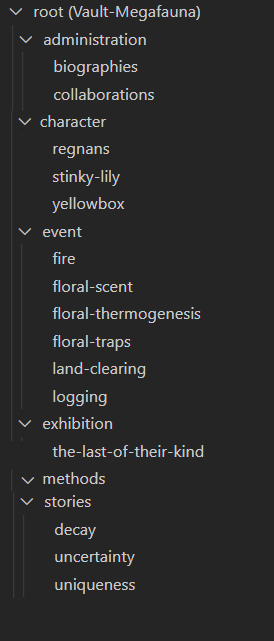

## Wiki tasks

To write new content
- [ ] write definition of story
- [ ] write definition of character
- [ ] write definition of event
- [ ] 
- [x] divide into stories
- [x] import slides
- [ ] provide supporting evidence with references (in Chicago full note) 
- [ ] provide additional images or links to videos/gifs, audio files as needed
- [ ] provide interesting citations if relevant
- [ ] provide audio files
- [ ] include credits for all content
- [ ] provide additional argument structure documents

Admin
- [ ] images for bios?
- [ ] bios for DDL people

Character
- [ ] add references.
- [ ] link to events, stories, exhibition.
- [ ] Living regnans improve pointcloud

Events
- [ ] remove links to methods. 
- [ ] tidy up text and combine land-clearing and logging
Methods

Stories

exhibition

## Done

- [x] fill out character notes per story (chars: living/dead-standing/dead-collapsed regnans, small and big trees yellowbox, lily)
- [x] fill out event notes per story (events: logging, fire, decay, clearing, heating, odour-emitting)

- [x] implement gitHub actions @sjaakjules
- [x] hide admin and not ready pages @sjaakjules
 
### Integrate video

- [ ] integrate and explain the shots in the video (thumbnail and additional info, images, and references)

## Video tasks

- [x] create the main title
- [x] create chapter titles on while, not on images
- [x] write up the script and upload for editing
- [ ] record the captions as audio
- [x] do not repeat images (inside of the trunk, foliage)
- [x] stabilise static shots
- [x] make images fill screen, frame as smaller images in the centre for documentary shots
- [x] give plenty of white/black space to all shots
- [ ] can one fix the near clipping plane?

## Future video tasks

- [ ] debrief the video editing the The Last of Their Kind
- [ ] generate more shots what animate data analysis (clustering, branch/leaf detecion, etc.; combine with simple and contrasting camera movements: toward, through; and views: front, top, axonometric)
- [ ] produce a matrix of techniques and shots with thumbnails for future use
