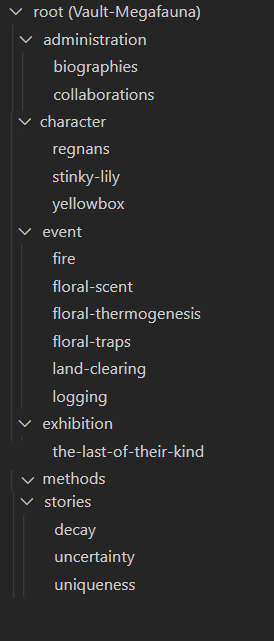

## Wiki tasks

- [ ] fix broken image living regnans
- [ ] export better potree windows
- [ ] fix links to research for exhibition
- [x] match the 'bloom' style: headings, captions, bolding @sjaakjules
- [x] methods landing has content
- [x] methods videos sizes too large
- [ ] stories are repetition of info in events.
- [ ] Decay can be moved to events.
- [ ] images for bios?
- [ ] bios for DDL people
- [ ] cross link all pages, characters, events, exhibition
- [ ] Decay has references, fix to use footnote style

To write new content

- [ ] write definition of story
- [ ] write definition of character
- [ ] write definition of event
- [ ] write definition of methods

- [x] divide into stories
- [x] import slides
- [x] provide supporting evidence with references (in Chicago full note) 
- [x] provide additional images or links to videos/gifs, audio files as needed
- [x] provide interesting citations if relevant
- [ ] provide audio files
- [ ] include credits for all content
- [x] provide additional argument structure documents

## Done

- [x] fill out character notes per story (chars: living/dead-standing/dead-collapsed regnans, small and big trees yellowbox, lily)
- [x] fill out event notes per story (events: logging, fire, decay, clearing, heating, odour-emitting)

- [x] implement gitHub actions @sjaakjules
- [x] hide admin and not ready pages @sjaakjules
 
### Integrate video

- [ ] integrate and explain the shots in the video (thumbnail and additional info, images, and references)

## Video tasks

- [x] create the main title
- [x] create chapter titles on while, not on images
- [x] write up the script and upload for editing
- [ ] record the captions as audio
- [x] do not repeat images (inside of the trunk, foliage)
- [x] stabilise static shots
- [x] make images fill screen, frame as smaller images in the centre for documentary shots
- [x] give plenty of white/black space to all shots
- [ ] can one fix the near clipping plane?

## Future video tasks

- [ ] debrief the video editing the The Last of Their Kind
- [ ] generate more shots what animate data analysis (clustering, branch/leaf detecion, etc.; combine with simple and contrasting camera movements: toward, through; and views: front, top, axonometric)
- [ ] produce a matrix of techniques and shots with thumbnails for future use
