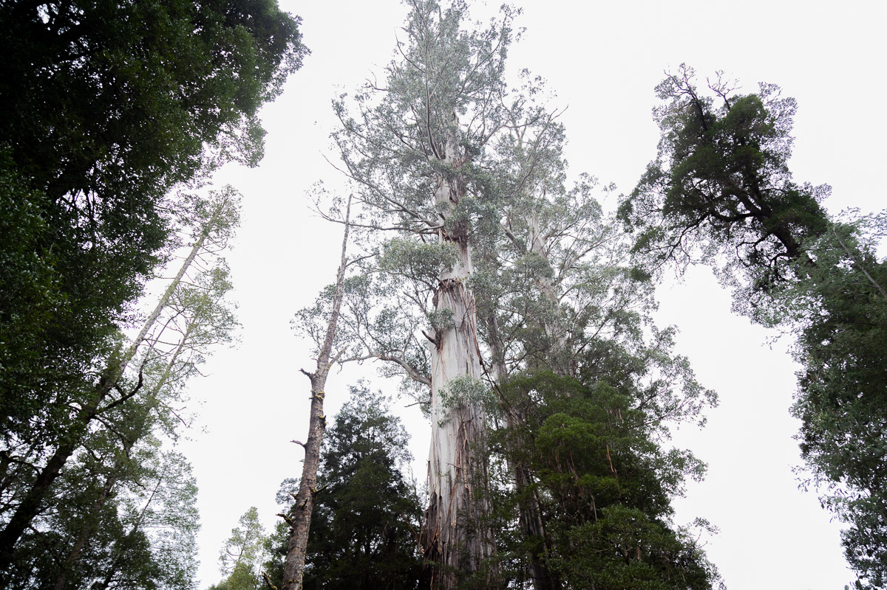
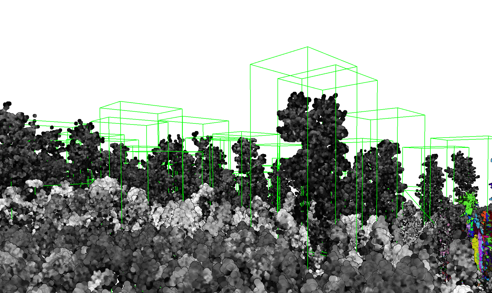

The first character in the story is a living 500 year old tree in the Styx valley. This stand of trees have survived disturbances including [[fire|events.fire]] and [[land clearing|events.land-clearing]].

## Location: Tolken Track, Styx

>Some of the remaining giant trees of the Styx Valley were saved from logging by years of dedicated campaigning by the Wilderness Society & Greenpeace. In 2013, part of the Styx Valley was incorporated into the Tasmanian Wilderness World Heritage Area thanks to the Tasmanian Forestry Agreement, which is sometimes called the Forest Peace Deal. Successive Tasmanian governments have worked hard to dismantle this agreement.
>
>This site is home to one of the most successful protest actions which saved the Styx Valley from being logged and saw its rivers and ancient forests added to the Tasmanian Wilderness World Heritage Area in 2013. The Global Rescue Station, a collaboration between Greenpeace and the Wilderness Society, was a series of platforms perched in a magnificent swamp gum where activists from around Australia and the planet lived aloft, sending interviews, photographs and video footage to the world. The tree was named Gandalf’s Staff, and it is the star of this walk that makes its way through a wonderland of ancient trees and luscious ferns suggestive of Tolkein’s Middle Earth.

Source: [The Tree Projects](https://www.thetreeprojects.com/styx-valley)

A cluster of living giant regnans in the Styx valley (green boxes).

## Agent: _Euclytpus regans_

The first regnans character is a living regnans in the Styx valley.

<iframe src="https://giphy.com/embed/rL49PB6EQNIGmJPo5s" width="100%" height="100%" style="position:absolute" frameBorder="0" class="giphy-embed" allowFullScreen></iframe>

>Every time you go to a giant tree you see something new in it and yourself. I see something that’s been alive hundreds of years before me and will be there hundreds of years after me. It’s humbling to consider all the years of my life are merely a small chapter of theirs. Climbing these trees is where I started. Up a tree you see things from a perspective no one else has ever seen.”

Source: [The Guardian](https://www.theguardian.com/environment/2019/dec/15/tasmanias-flowering-giants-we-will-never-see-such-trees-again)

>Large old trees support a wide range of key attributes that are either poorly developed or absent from smaller, younger trees. Many of these attributes are relatively well documented such as tree height, diameter and the presence of cavities. Others are not and remain poorly studied and understood.  The canopies of large old trees have often been considered as new frontiers for the discovery of huge numbers of species (Ozanne et al., 2003). [^1]

<iframe src="https://giphy.com/embed/Zk4060qnHL1t0lNHHc" width="100%" height="100%" style="position:absolute" frameBorder="0" class="giphy-embed" allowFullScreen></iframe>

>Time-consuming methods such as climbing trees to complete above-ground measurements may be required to meet some of these challenges, although emerging technologies such as laser scanning and light detection and ranging (LIDAR) can make useful contributions in some contexts (Thomas et al., 2013; Nolke et al., 2015) and have helped to reveal huge individuals of existing tree species (Yard, 2013). [^1]

<iframe src="https://www.julianrutten.com/testLand/testLand/styx2.html" width="100%" height="100%" style="position:absolute" frameBorder="0" class="giphy-embed" allowFullScreen></iframe>

>There are substantial challenges in studying certain attributes of large old trees such as features that cannot be accurately quantified using ground-based methods. The presence and attributes of cavities is an example (Cockle etal., 2011). Destructive tree dissection to explore internal cavity dimensions (Mackowski, 1987) is inappropriate in very large, rare or ecologically and culturally important specimens.[^1]

<iframe src="https://giphy.com/embed/M956BmAVGuDTiqE1OW" width="100%" height="100%" style="position:absolute" frameBorder="0" class="giphy-embed" allowFullScreen></iframe>

>But there are other likely highly species-rich environments associated with some species of large old trees that remain almost entirely unexplored. The extensive decorticating bark microhabitats of Australian eucalypts is one such example.[^1]

<iframe src="https://giphy.com/embed/hfRbyyF1l7ksUfiRme" width="100%" height="100%" style="position:absolute" frameBorder="0" class="giphy-embed" allowFullScreen></iframe>

>Large streamers of decorticating bark hanging from the lateral branches of large old mountain ash (Eucalyptus regnans) trees in Australia. These streamers are best developed on the largest trees in old-growth stands (Lindenmayer et al., 2000) and are an unstudied microhabitat for a rich array of invertebrate taxa such as flightless tree crickets (insect). [^1]

[^1]: Lindenmayer, David B., and William F. Laurance. ‘The Ecology, Distribution, Conservation and Management of Large Old Trees’. Biological Reviews, no. 132 (2016): 1434–58. https://doi.org/10/gdvpqh.
