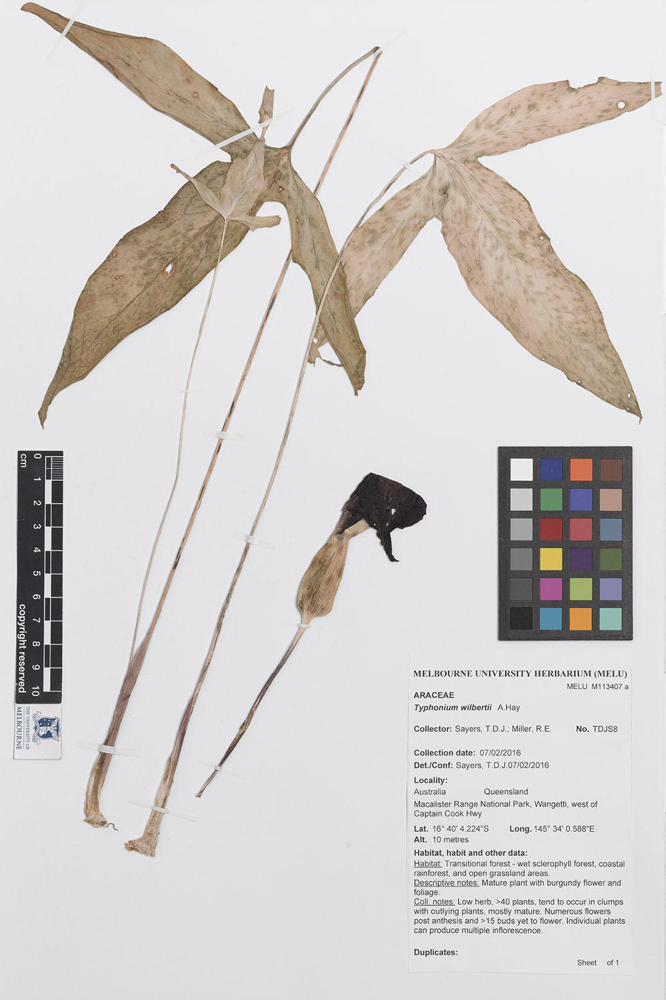

## Family: _Araceae_ | Genus:  _Typhonium_ | Species: _brownii_

{max-width: 400px}  
Initial sketch for Kew gardens. Specimen observed due to Mr Bull who collected rare plants even when little commercial worth existed. [^1]

Distribution of T. brownii taxa (black dots) and T. eliosurum (grey dots) (Atlas of Living Australia); letters correspond to the source locations of (A) T. brownii FNQ, (B) T. brownii SEQLD, (C) T. sp. aff. brownii (D), T. brownii NSW, (E) T. cf. brownii and (F) T. eliosurum. Images show the reproductive organs of hermaphrodite inflorescences with the spathe partially removed (scale bar = 1 cm).  
Features shown are the spadix (surrounded by the spathe), consisting (from top to bottom) of the appendix, staminate zone above the spathe constriction, a sterile zone including hair-like extensions and the pistillate zone at the base of the floral chamber. [^2]

## Anthesis, the flowering period

Annotation of endangered Typhonium sp. aff. brownii by Rebecca Miller. [^2]

## Floral scent

{max-width: 500px}

Typical scent chromatograms for (A) T. brownii FNQ, (B) T. brownii SEQLD, (C) T. sp. aff. brownii, (D) T. brownii NSW, (E) T. cf. brownii, and (F) T. eliosurum. Eight VOCs with the largest % peak area for each T. brownii taxon and T. eliosurum are labelled in that region/species and across other regions/species if also detected. [^2]  
Numbers indicate the following compounds:  
(1) α-phellandrene, (2) unknown 1437, (3) α-copaene, (4) pentadecane, (5) unknown 1531, (6) α-gurjunene, (7) *neoisolongifolene, (8) unknown 1591, (9) β-gurjunene, (10) β-caryophyllene, (11) unknown 1607, (12) aromandendrene, (13) *valerena-4,7(11)-diene, (14) α-guaiene, (15) alloaromadendrene, (16) acetophenone, (17) α-humulene, (18) unknown 1689, (19) unknown 1700, (20) caparratriene, (21) methyl geranate, (22) viridiflorene, (23) germacrene D, (24) bicyclogermacrene, (25) δ-cadinene, (26) unknown 1781, (27) dihydro-β-ionone, (28) geranylacetone, (29) junenol, (30) p-cresol, (31) indole, (32) skatole (*identification by library match only). [^2]

## Plant divergence

_Typhonium brownii_ has a wide distribution with variations within thermogenesis timing,  floral scent and pollination attraction. Of the species selected the endangered species has the most divergent characteristics.

-----

Family: _Araceae_ | Genus: _Typhonium_ | Species: _wilbertii_  
{max-height: 400px}
{max-height: 500px}  
_Typhonium wilbertii_. Left, preserved specimen. Right, laboratory specimen captured with LiDAR.

{max-width: 570px}  
LiDAR scan of _Typhonium wilbertii_ flower before it has fully opened.

[^1]: Hooker, Joseph Dalton. "Typhonium brownii" Curtis's Botanical Magazine 101, [ser.3:v.31] (1875): tab. 6180.

[^2]: Sayers, Thomas, Martin Steinbauer, Kevin Farnier, and Rebecca Miller. ‘Dung Mimicry in _Typhonium (Araceae)_: Explaining Floral Trait and Pollinator Divergence in a Widespread Species Complex and a Rare Sister Species’. Botanical Journal of the Linnean Society 193 (2020): 375–401. <https://doi.org/10/gjkgwx>.

[^3]: Díaz Jiménez, Pedro, Heiko Hentrich, Pedro Aguilar-Rodríguez, Thorsten Krömer, Marion Chartier, María Cristina Mac Swiney González, and Marc Gibernau. ‘A Review on the Pollination of Aroids with Bisexual Flowers’. Annals of the Missouri Botanical Garden 104 (2019): 83–104. <https://doi.org/10/gm922k>.

[^4]: Gibernau, Marc, Marion Chartier, and Denis Barabé. ‘Recent Advances Towards an Evolutionary Comprehension of Araceae Pollination’. In Diversity, Phylogeny and Evolution in the Monocotyledons., by Seberg Ole, Davis Jerrold, Petersen Gitte, and Barfod S. Anders. Aarhus: Aarhus University Press, 2010. <https://doi.org/10.13140/2.1.2636.0965>.

[^5]: Sayers, Thomas. ‘The Ecology and Evolution of Plant-Pollinator Interactions in Australian Typhonium (Araceae)’. PhD Thesis, The University of Melbourne, 2019.

[^6]: Bröderbauer, David, Anita Diaz, and Anton Weber. ‘Reconstructing the Origin and Elaboration of Insect-Trapping Inflorescences in the Araceae’. American Journal of Botany 99 (2012): 1666–79. <https://doi.org/10/f4c28j>.

[^7]: Urru, Isabella, Marcus C. Stensmyr, and Bill S. Hansson. ‘Pollination by Brood-Site Deception’. Plant-Insect Interactions 72, no. 13 (2011): 1655–66. <https://doi.org/10/cfn63h>.
