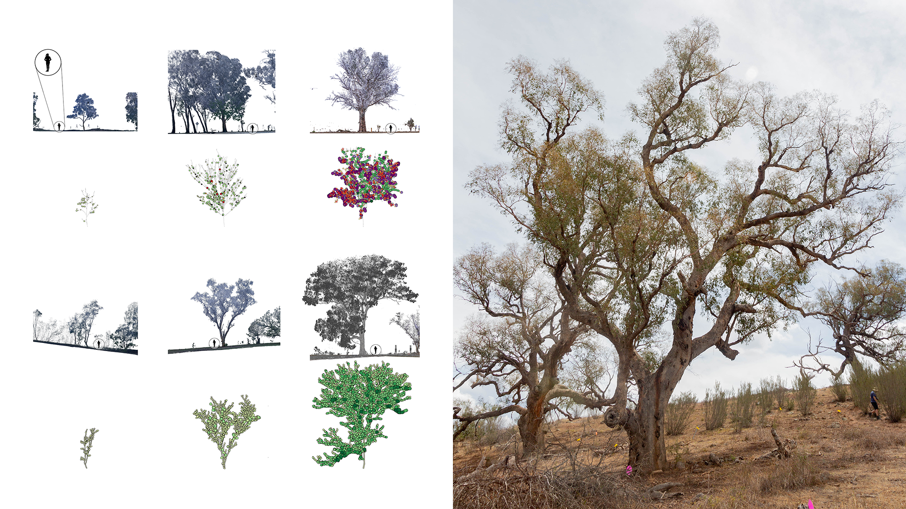
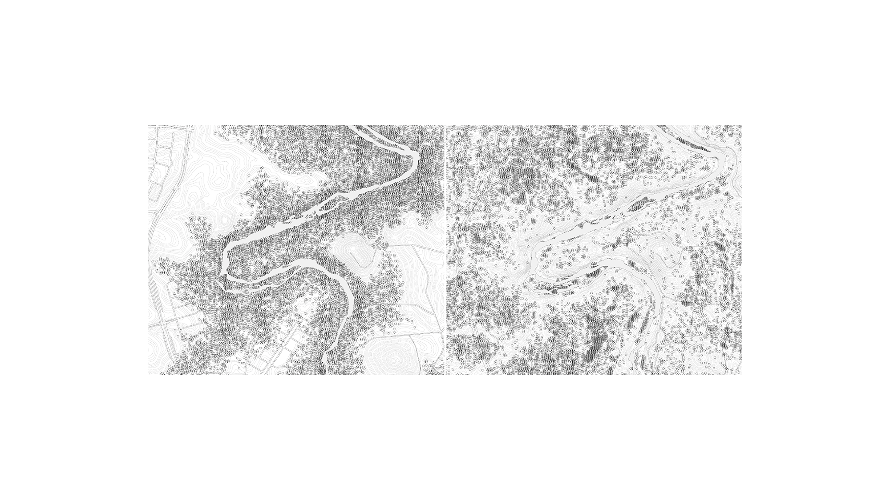
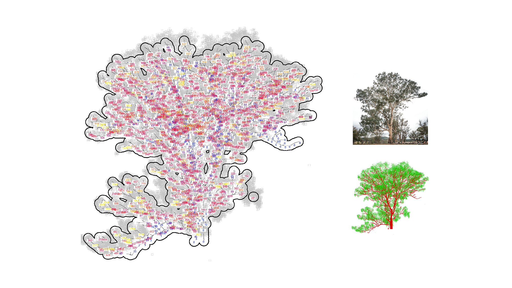
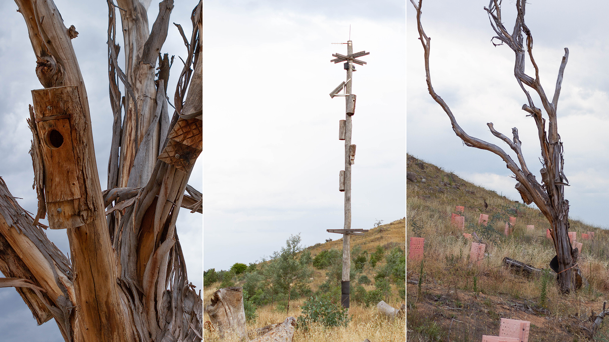

#### Yellowbox (Eucalyptus melliodora) grassy woodlands

#### 97% lost since the European Colonisation

This story is about a disappearing form of landscape and its interlinked communities.
Close to many cities and unnoticed by most human live the last remnants of a once mighty community. These communities of yellowbox trees, grasses and many other beings last thousands of years. Birds nest in dead branches of older trees and feed on the insects in rotting bark. Lizards and insects hide in the grass or on in the folds of the trunks. Recent human land use destroys saplings and as the older trees die, the community dwindles.

Our story follows a group of small, medium, and large trees. Using data analysis and artificial intelligence we recognise leaves, branches, and other vital features in complex tree structures. Combining these capabilities with observations of bird behaviour we consider relationships between trees and arboreal life, in support of better understanding of their roles and significance.

See [[methods.imaging.tls]]

>What you see > A statistical representation of different trees and their meaning as habitats, left; a remnant patch of woodland surviving on a hill in the southeast plains of Australia.
Who speaks > A yellowbox grassy woodland community.

>What the woodland says > “I am not one but many: we are birds, mammals, reptiles, and plants. Our woods were once widespread. My other creatures cannot live without large old trees.”

>What you see > A map of tree densities some 300 years ago, before the European colonisation, in a cleared landscape on the outskirts of Canberra, in southeast Australia, in a landscape that currently has no trees.

>What the woodland says > “We grew in poor soils and apart from each other. Paddocks, streets and farms killed many.”

>What you see > An old tree in an urban park on the outskirts of Canberra. This tree has two kilometres of branches, and algorithm that finds branches preferred by birds.
What the woodland says 
> “Even when the paddocks and cities came, some of our old trees remained. They are rich with many creatures in a simplified landscape. Birds perch and on branches. Insects live in bark cracks.”

>What you see > Human-installed trees at a restoration site on the outskirts of Canberra that suffers from human action during the last 230 years.
What the woodland says > “With the elder trees dying, the birds and others die too.”

Refer [[methods.stories.decay]]

>What you see > A denuded hill at a restoration site. You can see thousands of new planted trees. They will take hundreds of years to grow into keystone specimens. Meanwhile, the wildlife has no homes, invasive plants dominate on the overfertilized soil, the climate warms and the grassy woodlands cannot return.
What the woodland says > “Human broke our cycles. The seedlings cannot take root. For hundreds of years, we had no young to replace the elders. Humans look at the future without old trees.”
