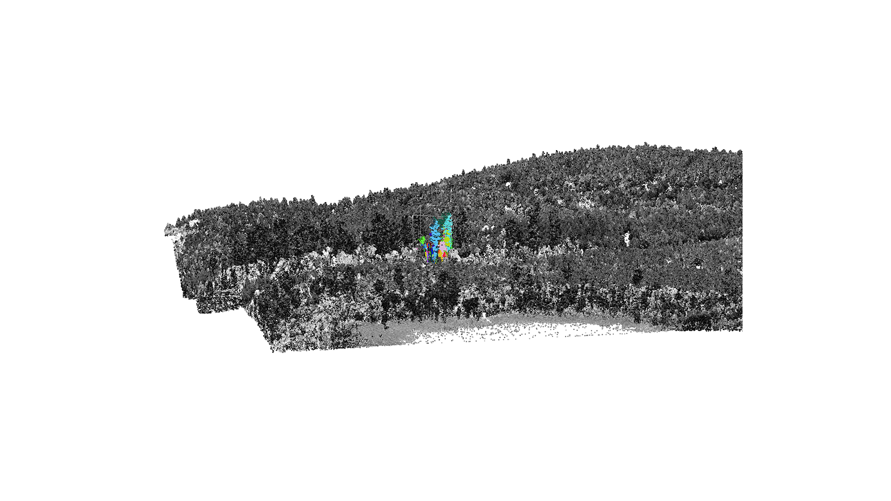
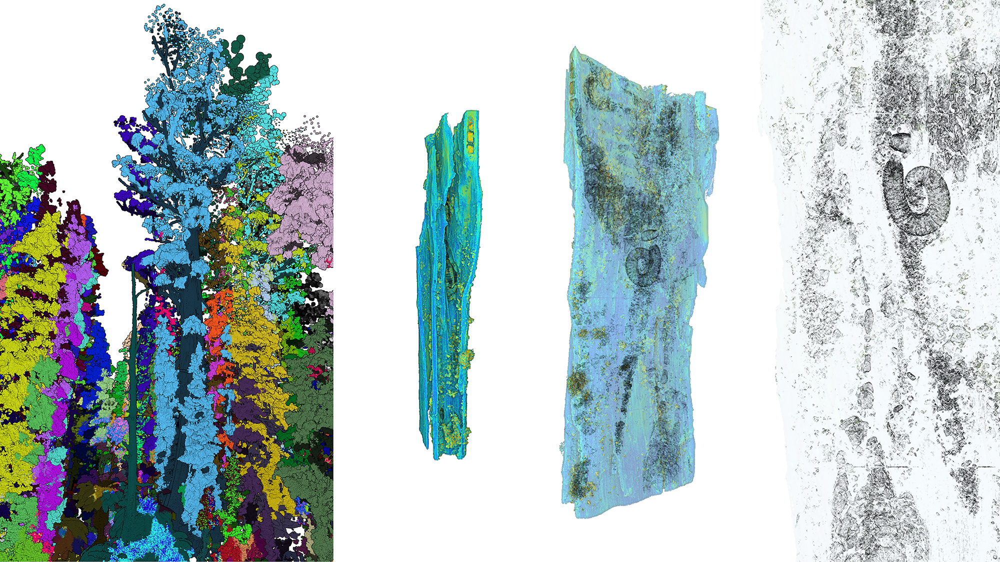
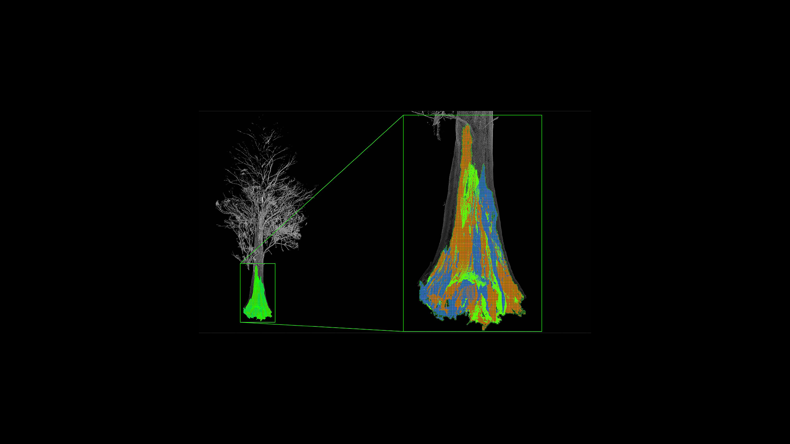
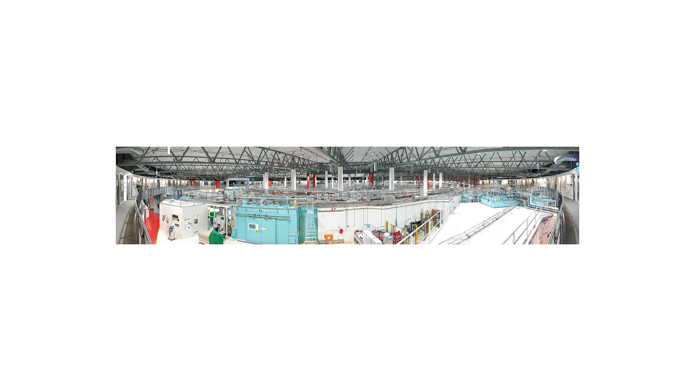
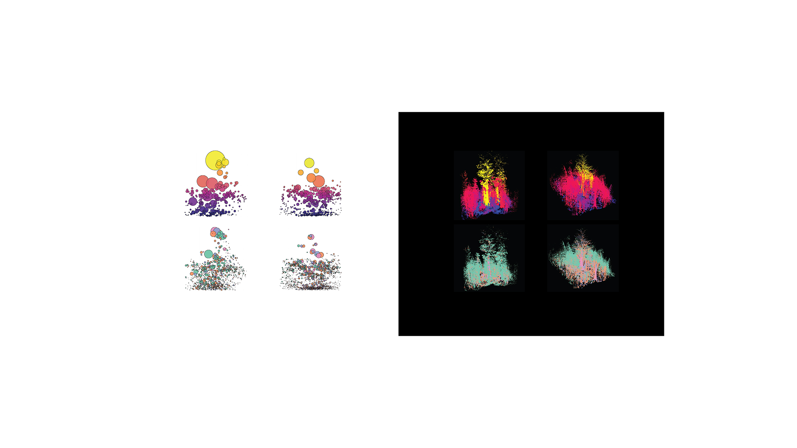

**Old mountain ash tree (Eucalyptus regnans), 200 left, with twelve of the largest twenty burnt in 2019**

This story is about a disappearing stage of life, and death.

Eucalyptus regnans trees live in Australia’s southern forests. Among frequent bushfires, they have evolved to die and grow quickly. In wet Tasmania the fires are rare. There, cool valleys are home to elders that live for hundreds of years. They are among the largest organisms on the Earth. However, the climate is warming, and the forests are drying. The giants burn, fall, and die. Humans are not likely to ever see such trees again. The forest community will have no elders. See [[stories.uncertainty]]

Large old trees are homes to many beings and hold many stories. We show topographies that create wet conditions, stands of giant trees, individual living and dead trees and their neighbours, bark, moss, lichen, epiphytes and animals that live within them. To trace this story, we use computational analysis and artificial intelligence to probe the data acquired by [[laser imaging|methods.surface-imaging]] and [[radiation|methods.tomography]].

**What you see** > three giant trees: one living; one dead, still standing; one fallen in the valleys of Tasmanian rainforests during the dying days of the Holocene.
**Who speaks** > 400-year old Eucalyptus regnans trees (mountain ash, swamp gum, stringy bark, giant gum), first seen by humans some 60,000 years ago, distinct as the Eucalypteae tribe for some 60 million years; the tallest flowering plant on the Earth. See [[stories.uniqueness]].
**What the elders say** > “Expecting our deaths at any moment, we grow quickly. In wet, cool refuges, we remain undisturbed. Here, we live for hundreds of years. We are now the elders. Yet, the forest is changing. Fires burn stronger and more often. Many elders have fallen.”

**What you see** > stand of remnant giants, coloured; hundreds of years old, growing in the Styx valley, an area with tolerable disturbances.
**What the elders say** > “The hills make clouds drip. Moss and lichens line the gullies. Ferns, sassafras and myrtle shade the ground. In these cool, wet places, we grow above others.”

**What you see** > An elder tree (blue, left) in a forest clearing saved from wood harvesting soil disturbance or forest segmentation; a fragment of bark and its inhabitants.
**What the elders say** > “We live together with many others. We steady the climate. Our branches host ferns, epiphytes, fungi and lichens. We control water and soil, feed birds, and shelter the smallest of creatures.”

**What you see** > A state of a recently burnt valley, six months after the 2019 bushfires. A dead standing elder, orange, middle; remnants if a burnt tree, blue, left, combined with data overlay that shows the outlines of previously existing foliage, green.
**What the elders say** > “When dead, we stand tall, a home to many. We still feed the others after we fall.”

**What you see** > A decaying tree in a wet sclerophyll forest. A giant hollow, green, in an old tree, grey; bigger than an average room and full of multispecies life.
**What the elders say** > “We decay as we live, such is our way. We decay to give back. In this way we live long, beyond your lives and your civilisations.”

**What you see** > The main ring of the particle accelerator at the Australian Synchrotron. Trees are too large for most volumetric-imaging devices, so we used the high-powered beam of the synchrotron instead.

**What you see** > The size of living tree and a relatively small limb of a tree as large as a human body held by a robot for the synchrotron scanning.
**What the elders say** > “After we are gone, these landscapes may never see such the likes of us again.”

**What you see** > Plant features, recognised and quantified with imaging and artificial intelligence techniques.
**What the elders say** > “What will remain when we are gone?”
